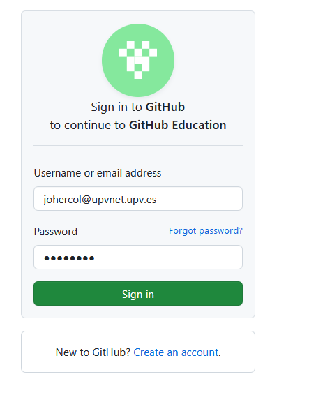
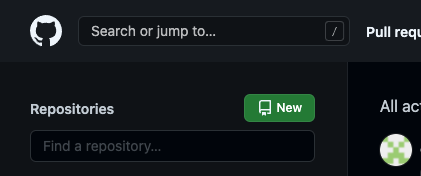
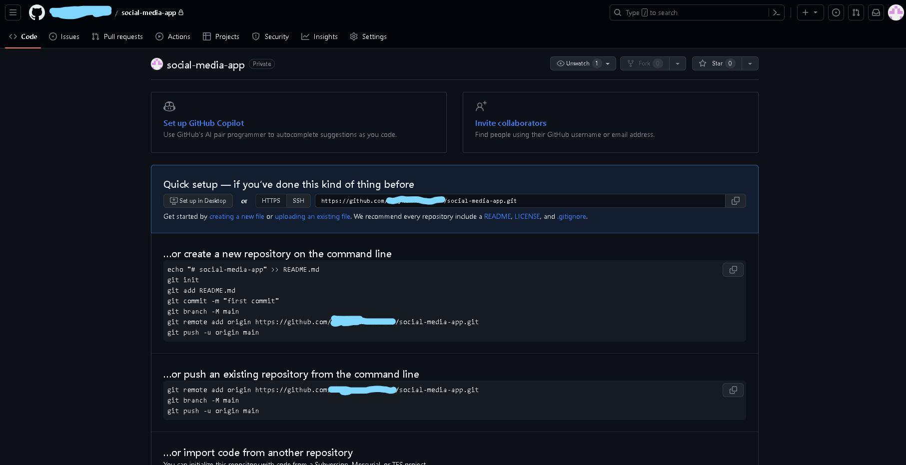
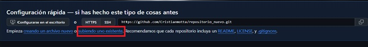
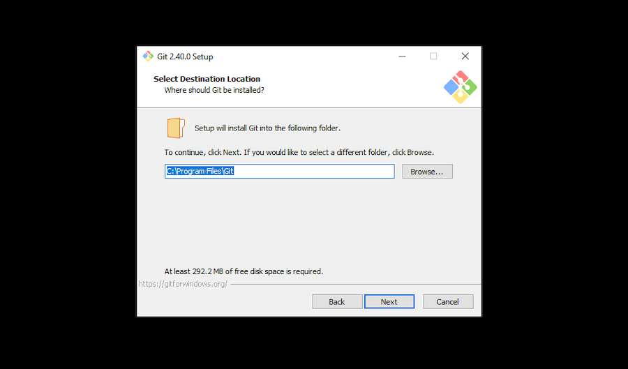

# Git & GitHub – Tutorial Básico Desde Cero

### 1. Crear una cuenta en GitHub

Para comenzar a trabajar con Git y GitHub, primero debemos crear una cuenta en la plataforma oficial:

Ir a: https://github.com

Allí debemos registrarnos con nuestro correo electrónico (Gmail u otro).

Pasos:

1. Ingresar a GitHub.

2. Hacer clic en Sign up.

3. Ingresar correo electrónico.

4. Crear contraseña.

5. Elegir nombre de usuario.

6. Verificar cuenta.

## 2. Crear nuestro primer repositorio
Una vez dentro de GitHub:

Ir a la esquina superior derecha.

Hacer clic en el botón New repository.

Asignar:

* Nombre del repositorio.

* Descripción (opcional).
 
* Público o Privado.

Clic en Create repository.

Aquí es donde GitHub nos mostrará las instrucciones para subir nuestro proyecto desde la consola.

Para subir un Repositorio en Git sin la necesidad de subirlo con comandos podemos subirlo con el apartado de uploading an existing file.

## 3. Instalar Git en nuestro computador

Para poder subir archivos mediante comandos necesitamos instalar Git.

Descargar desde su página oficial:

> https://git-scm.com/

Instalar normalmente dejando las opciones por defecto.

Para verificar que está instalado correctamente abrimos la terminal (Git Bash o CMD) y escribimos:

> git --version

Si muestra la versión, significa que está instalado correctamente.

Ejemplo:
> git version 2.50.0.windows.1
 
## 4. Configuración inicial de Git

Antes de comenzar debemos configurar nuestro usuario global.

* Configurar nombre:
> git config --global user.name "TuNombre"

* Configurar correo:
> git config --global user.email "tuemail@gmail.com"

Ver configuración actual:

> git config --list

Esto es importante porque cada commit quedará registrado con estos datos.

### Cerrar sesión o cambiar usuario en Git

Git no maneja "sesión iniciada" como GitHub en el navegador.
Lo que realmente guarda es tu configuración de usuario (nombre y correo).

Si deseas eliminar el usuario configurado globalmente, debes usar:

* Eliminar nombre global
> git config --global --unset user.name

* Eliminar correo global
> git config --global --unset user.email

Después puedes verificar con:

> git config --list

Si deseas cambiar el usuario simplemente vuelves a configurar:

> git config --global user.name "NuevoNombre"

> git config --global user.email "nuevoemail@gmail.com"

### Nota Importante

> --global afecta todos los repositorios del computador.

Si quieres cambiar el usuario solo en un proyecto específico, debes quitar --global y ejecutar el comando dentro del proyecto.

Ejemplo local:

* git config user.name "UsuarioLocal"
* git config user.email "correo@local.com"

## 5. Subir nuestro primer proyecto con Git Bash
Crear carpeta del proyecto

Creamos una carpeta en nuestro computador.

Ejemplo:

> mkdir mi-primer-proyecto

> cd mi-primer-proyecto

## 6. Inicializar repositorio Git

> git init

Este comando crea un repositorio local en nuestra carpeta.

## 7. Agregar archivo al área de preparación

> git add .

El punto significa que agregamos todos los archivos.

También podemos agregar uno específico:

> git add index.html

## 8. Crear nuestro primer commit

> git commit -m "Primer commit - Hola Mundo"

El commit es como una fotografía del proyecto en ese momento.

## 9. Conectar nuestro proyecto local con GitHub

Copiamos el enlace del repositorio que GitHub nos da.

Luego ejecutamos:

> git remote add origin https://github.com/usuario/repositorio.git

Verificar conexión:

> git remote -v

## 10. Subir nuestro proyecto a GitHub

Si es la primera vez:

> git branch -M main

> git push -u origin main

Después solo necesitaremos:

> git push