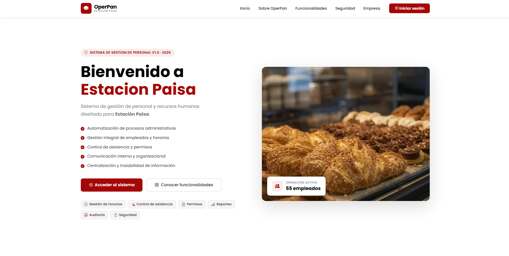
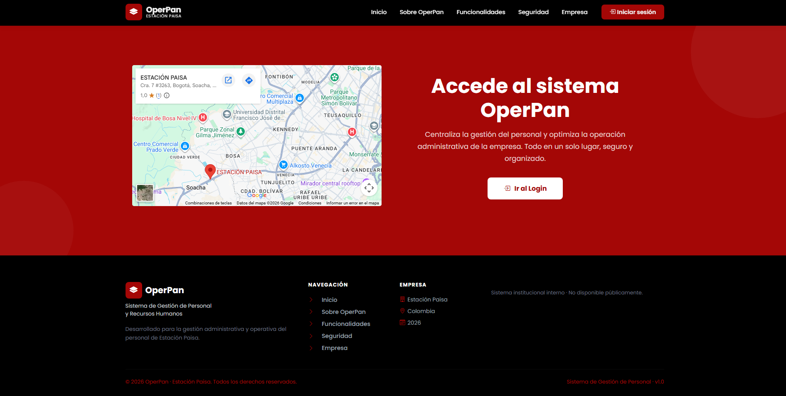
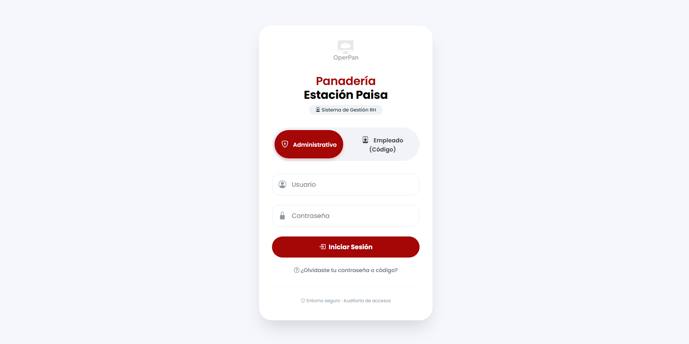
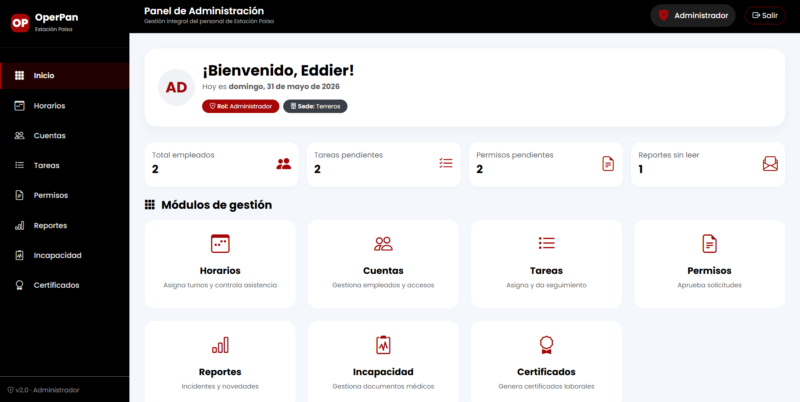
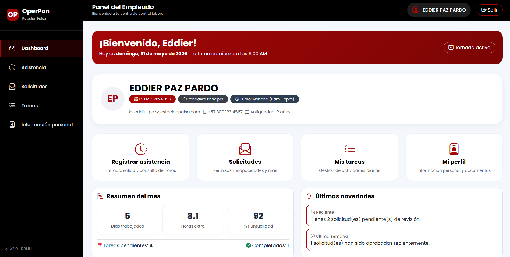

# OperPan — Gestión de Personal

> Sistema web administrativo para la gestión de personal y recursos humanos en panaderías.

**[Ver aplicación en producción](https://operpangestion.github.io/OperPan/)**

---

OperPan es una plataforma institucional desarrollada para **Estación Paisa** que digitaliza y centraliza los procesos de administración de personal: horarios, asistencia, permisos, tareas, incapacidades y certificados laborales, todo en un único sistema organizado y trazable.

---

## Características principales

- Gestión completa de empleados (alta, modificación, baja)
- Asignación y administración de horarios y turnos
- Control de asistencia con historial por empleado
- Gestión de permisos, incapacidades y solicitudes
- Módulo de tareas con seguimiento y estados
- Reportes y estadísticas administrativas
- Generación de certificados laborales
- Control de accesos por roles (Administrador, Gerente, Empleado)

---

## Objetivo

Eliminar el manejo manual de procesos operativos en panaderías mediante una plataforma centralizada, accesible y escalable que mejore la productividad, reduzca errores y facilite la toma de decisiones basada en datos.

---

## Tecnologías


---

## Capturas

### Homepage


### Acceso al sistema


### Login


### Panel Administrador


### Panel Empleado


---

## Estructura del repositorio

```
OPERPAN/
├── index.html                  ← Homepage / Portal corporativo
├── Assets/styles.css           ← Estilos globales
├── Pages/
│   ├── login.html
│   ├── admin/                  ← Módulos para Admin/Gerente
│   │   └── sub-pages-admin/
│   └── Empleado/               ← Módulos para Empleado
│       └── sub-pages-empleado/
└── Scripts/script.js
```

---

## Estado del proyecto

**En desarrollo activo** — Fase 1 (Frontend completo) ✅ · Fase 2 (Backend + BD) 🔄 En progreso

---

## Próximas mejoras

- [ ] Integración con backend (API REST)
- [ ] Autenticación real con JWT
- [ ] Generación de PDF para certificados y reportes
- [ ] Exportación a Excel
- [ ] Notificaciones automáticas
- [ ] Soporte multi-sucursal

---

## Equipo

| Desarrollador | GitHub |
|---|---|
| Eddier Paz Pardo | [@EddierPaz](https://github.com/EddierPaz) |
| Santiago Muñetón | [@santiagoencodigo](https://github.com/santiagoencodigo) |
| Andrea Herrera | [@AndreaHerreraDev](https://github.com/AndreaHerreraDev) |

> Proyecto desarrollado en el **SENA** · Análisis y Desarrollo de Software · Ficha 3171608

---

## Licencia

Este proyecto está bajo licencia MIT. Consulta el archivo `LICENSE` para más detalles.